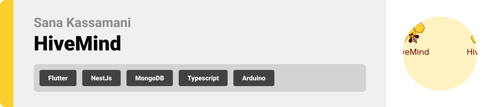
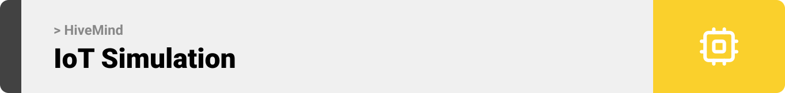

<br><br>

<!-- project philosophy -->


> A mobile application for smart beehive management, assisting beekeepers in monitoring hive health and improving honey harvest.
>
> HiveMind tracks hive conditions with real-time monitoring via IoT devices. It provides AI insights on harvest timing, pest infestations, and weather conditions. Ultimately, it streamlines collaboration between hive owners and beekeepers.

### User Stories

#### Owner

- As an owner, I want to check my apiaries and hives and their location, so I can keep track of their conditions.
- As an owner, I want to receive recommendations on hive activities, so I can ensure maximum harvest.
- As an owner, I want to assign tasks to beekeepers, so I can make sure the work gets done on time.

#### Beekeeper

- As a beekeeper, I want to receive hive conditions from sensors and manually add some, so I can track the hives health.
- As a beekeeper, I want to upload hive pictures and audios, so I can monitor pests or abnormal activity.
- As a beekeeper, I want to receive tasks from the owner and mark them as done, so I can keep the owner updated on my progress.

#### Admin

- As an admin, I want to track all users and their activity, so I can ensure app is used appropriately.
- As an admin, I want to manage user accounts, so I can add, update, or deactivate users as needed.
- As an admin, I want to view and edit details of all apiaries and hives, so I can maintain accurate records of the hives and their conditions.

<br><br>

<!-- Tech stack -->


### Hivemind is built using the following technologies:

- This project uses the [Flutter app development framework](https://flutter.dev/). Flutter is a cross-platform hybrid app development platform which allows us to use a single codebase for apps on mobile, desktop, and the web.
- This project uses the [NestJS server-side framework](https://nestjs.com/), a progressive Node.js framework built with TypeScript and JavaScript, designed for building efficient, reliable, and scalable server-side applications.
- For database operations, the app utilizes [MongoDB](https://www.mongodb.com/), a NoSQL database that supports flexible and scalable data storage, along with [MongoDB Compass](https://www.mongodb.com/products/tools/compass) for an intuitive graphical interface to manage and visualize the database.
- For IoT integration, the app utilizes the ESP12E-8266 module, a low-cost Wi-Fi module developed by [Espressif System](https://www.espressif.com/en/products/modules/esp8266) and ideal for IoT applications, offering built-in Wi-Fi and GPIO capabilities. The module was programmed using [PlatformIO](https://platformio.org/), a VS Code extension for firmware development.
- The admin panel was developed using [ReactJS](https://react.dev/), a popular JavaScript library for building dynamic, responsive, and efficient single-page applications.
- The machine learning model is served using [Flask](https://flask.palletsprojects.com/en/stable/), a lightweight Python web framework ideal for creating APIs and serving models efficiently.
- To send local push notifications, the app uses the [flutter_local_notifications](https://pub.dev/packages/flutter_local_notifications) package which supports Android, iOS, and macOS.

<!-- - The app uses the font ["Work Sans"](https://fonts.google.com/specimen/Work+Sans) as its main font, and the design of the app adheres to the material design guidelines. -->

<br><br>

<!-- UI UX -->


> We designed HiveMind using wireframes and mockups, iterating on the design until we reached the ideal layout for easy navigation and a seamless user experience.

- Project Figma design [figma](https://www.figma.com/design/AIptVTX0dJFBQaGKdf3dAY/UI-UX-Assignments?node-id=0-1&node-type=canvas&t=0t6X8FZMun35SXlq-0)

### Mockups

| Home screen                             | Menu Screen                           | Order Screen                          |
| --------------------------------------- | ------------------------------------- | ------------------------------------- |
|  |  |  |

<br><br>

<!-- Database Design -->


### Architecting Data Excellence: Innovative Database Design Strategies:

- Insert ER Diagram here

<br><br>

<!-- Implementation -->


### User Screens (Mobile)

| Login screen                              | Register screen                         | Landing screen                          | Loading screen                          |
| ----------------------------------------- | --------------------------------------- | --------------------------------------- | --------------------------------------- |
|  |  |  |  |
| Home screen                               | Menu Screen                             | Order Screen                            | Checkout Screen                         |
|  |  |  |  |

### Admin Screens (Web)

| Login screen                            | Register screen                       | Landing screen                        |
| --------------------------------------- | ------------------------------------- | ------------------------------------- |
|  |  |  |
| Home screen                             | Menu Screen                           | Order Screen                          |
|  |  |  |

<br><br>

<!-- Prompt Engineering -->


### Mastering AI Interaction: Unveiling the Power of Prompt Engineering:

- This project uses advanced prompt engineering techniques to optimize the interaction with natural language processing models. By skillfully crafting input instructions, we tailor the behavior of the models to achieve precise and efficient language understanding and generation for various tasks and preferences.

<br><br>

<!-- AWS Deployment -->


### Efficient AI Deployment: Unleashing the Potential with AWS Integration:

- This project leverages AWS deployment strategies to seamlessly integrate and deploy natural language processing models. With a focus on scalability, reliability, and performance, we ensure that AI applications powered by these models deliver robust and responsive solutions for diverse use cases.

<br><br>

<!-- Unit Testing -->


### Precision in Development: Harnessing the Power of Unit Testing:

- This project employs rigorous unit testing methodologies to ensure the reliability and accuracy of code components. By systematically evaluating individual units of the software, we guarantee a robust foundation, identifying and addressing potential issues early in the development process.

<br><br>

<!-- How to run -->


> To set up Coffee Express locally, follow these steps:

### Prerequisites

This is an example of how to list things you need to use the software and how to install them.

- npm
  ```sh
  npm install npm@latest -g
  ```

### Installation

_Below is an example of how you can instruct your audience on installing and setting up your app. This template doesn't rely on any external dependencies or services._

1. Get a free API Key at [example](https://example.com)
2. Clone the repo
   git clone [github](https://github.com/your_username_/Project-Name.git)
3. Install NPM packages
   ```sh
   npm install
   ```
4. Enter your API in `config.js`
   ```js
   const API_KEY = "ENTER YOUR API";
   ```

Now, you should be able to run Coffee Express locally and explore its features.
