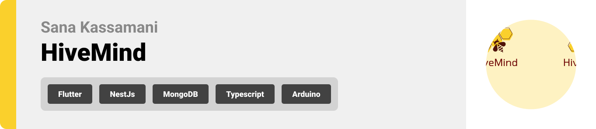
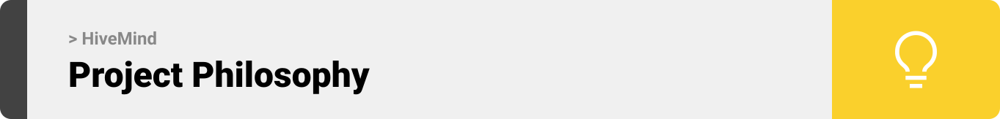
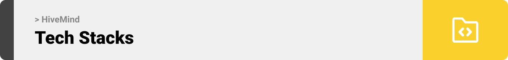
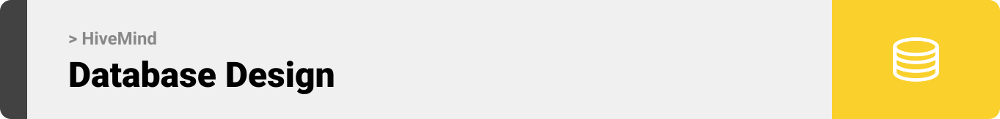
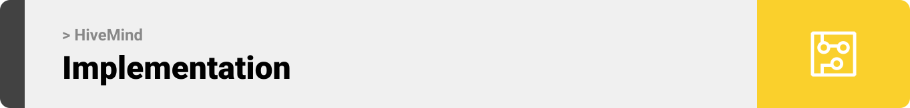
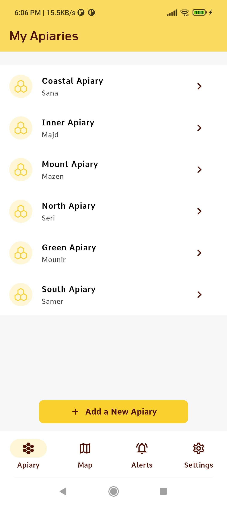
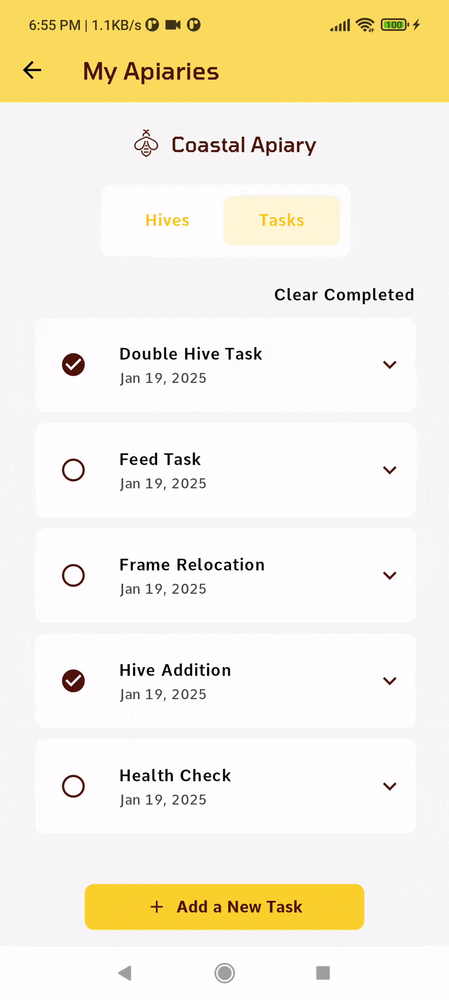

<br><br>

<!-- project philosophy -->


> HiveMind is a mobile app for modern beekeeping, utilizing IoT devices to monitor hive health, detect pests through hive images, and provide up-to-date weather insights for your apiary locations.
> It also fosters collaboration between hive owners and ground beekeepers, all within a single platform.

### User Stories

#### Owner

- As an owner, I want to check my apiaries and hives and their location, so I can keep track of their conditions.
- As an owner, I want to add/remove apiaries, hives and tasks, so I can manage my work efficiently.
- As an owner, I want to assign tasks to beekeepers, so I can make sure the work gets done on time.

#### Beekeeper

- As a beekeeper, I want to receive hive conditions from sensors, so I can track the hives health.
- As a beekeeper, I want to upload hive pictures, so I can monitor pests and diseases.
- As a beekeeper, I want to receive tasks from the owner and comment on them, so I can keep the owner updated on my progress.

#### Admin

- As an admin, I want to track all users and their activity, so I can ensure app is used appropriately.
- As an admin, I want to manage user accounts, so I can activate or deactivate users as needed.
- As an admin, I want to view details of all apiaries and hives, so I can maintain accurate records of the hives and their conditions.

<br><br>

<!-- Tech stack -->


### HiveMind is built using the following technologies:

- This project uses the [Flutter app development framework](https://flutter.dev/). Flutter is a cross-platform hybrid app development platform which allows us to use a single codebase for apps on mobile, desktop, and the web.
- This project uses the [NestJS server-side framework](https://nestjs.com/), a Node.js framework built with TypeScript and JavaScript, designed for building efficient, reliable, and scalable server-side applications.
- For database operations, the app utilizes [MongoDB](https://www.mongodb.com/), a NoSQL database that supports flexible and scalable data storage, along with [MongoDB Compass](https://www.mongodb.com/products/tools/compass) for an intuitive graphical interface to manage and visualize the database.
- For IoT integration, the app utilizes the ESP12E-8266 module, a low-cost Wi-Fi module developed by [Espressif System](https://www.espressif.com/en/products/modules/esp8266) and ideal for IoT applications, offering built-in Wi-Fi and GPIO capabilities. The module was programmed using [PlatformIO](https://platformio.org/), a VS Code extension for firmware development.
- The admin panel was developed using [ReactJS](https://react.dev/), a popular JavaScript library for building dynamic, responsive, and efficient single-page applications.
- The machine learning model is served using [Flask](https://flask.palletsprojects.com/en/stable/), a lightweight Python web framework ideal for creating APIs and serving models efficiently.
- The app integrates [Firebase Cloud Messaging](https://firebase.google.com/docs/cloud-messaging), a robust solution for sending notifications, to alert users to extreme hive conditions.
- To send local push notifications, the app uses the [flutter_local_notifications](https://pub.dev/packages/flutter_local_notifications) package which supports Android, iOS, and macOS.
- The app employs [Google Maps SDK](https://developers.google.com/maps/documentation/android-sdk/overview) to visualize apiaries' locations on Google Maps.
- The app uses [Open Weather Api](https://openweathermap.org/api) to fetch weather data at each apiary's location.

<br><br>

<!-- UI UX -->


> HiveMind was designed on Figma, starting with wireframes and progressing to mockups, with iterations focused on achieving smooth navigation and a seamless user experience.

- Project Figma design [figma](https://www.figma.com/design/AIptVTX0dJFBQaGKdf3dAY/UI-UX-Assignments?node-id=0-1&node-type=canvas&t=0t6X8FZMun35SXlq-0)

### Mockups

| Apiaries Screen - Owner                                                 | Hives Screen - Beekeeper                                                  | Tasks Screen - Beekeeper                                                |
| ----------------------------------------------------------------------- | ------------------------------------------------------------------------- | ----------------------------------------------------------------------- |
|  |  |  |

<br><br>

<!-- Database Design -->


## Database includes 2 standalone schemas Apiary and User, each having additional embedded schemas as shown below.


<br><br>

<!-- Implementation -->


### Owner Screens (Mobile)

| Apiaries Screen                                               | Hives of Apiary Screen                                       | Hive Details Screen                                           |
| ------------------------------------------------------------- | ------------------------------------------------------------ | ------------------------------------------------------------- |
|     |  |   |
| Add Apiary                                                    | Add Hive                                                     | Add Task                                                      |
|              |           |            |
| Delete Apiary                                                 | Map Screen                                                   | Complete Task                                                 |
|  |             |  |

### Beekeeper Screens (Mobile)

| Hive History Screen                                           | Image Analysis                                                   | Receiving Alerts                                            |
| ------------------------------------------------------------- | ---------------------------------------------------------------- | ----------------------------------------------------------- |
|  |         |     |
| Toggle Dark Mode                                              | Hive Details Dark                                                | Comment on Task - Dark                                      |
|        |  |  |

### Admin Screens (Web)

| Login Screen                                          | Users Screen                                                    |
| ----------------------------------------------------- | --------------------------------------------------------------- |
|        |                  |
| Apiaries Screen                                       | Apiary Details Screen                                           |
|  |  |

<br><br>

<!-- IoT Simualtion -->


### Smart IoT Simulation: Transforming Connectivity into Actionable Insights

- This project incorporates IoT devices to establish a connection between the mobile application and real-life beehives.
- The sensors employed include the DHT22, which measures temperature and humidity, and a load cell, which detects weight changes critical for determining the optimal timing for honey harvesting. These sensors interface with the ESP8266 module and periodically update the hive conditions in the application.

| Setup                                     | Sensors                                     | Setup Without Hive                         |
| ----------------------------------------- | ------------------------------------------- | ------------------------------------------ |
|  |  |  |

<br><br>

<!-- How to run -->


> To set up HiveMind locally, follow these steps:

### Prerequisites

- npm

  ```sh
  npm install npm@latest -g
  ```

- Flutter SDK from official documentation
- Python 3.10 from official documentation
- Arduino IDE or PlatformIO Extension in Visual Studio
- ESP8266 module
- Google Cloud Platform project with Places API and Maps SDK enabled
- Firebase CLI
- Firebase Project for notifications

### Installation

#### Cloning the Repository

1. Run the following command to clone the repository and all its submodules

   ```sh
   git clone --recurse-submodules [github](https://github.com/Sana-Kassamani/hivemind.git)
   ```

#### Server Configuration

1. Navigate to hivemind-server directory

   ```sh
   cd hivemind-server
   ```

2. Install NPM packages
   ```sh
   npm install
   ```
3. Run the following command and fill the necessary values in the created .env file
   ```sh
   cp .env.example .env
   ```
4. Navigate to your Firebase project in Firebase Console and maintain a Firebase Admin SDK for Nodejs, downloaded as a JSON file.
   Populate the .env file created with the current values from the downloaded JSON file.
5. Run Nestjs

   ```sh
   npm run start:dev
   ```

#### Application Configuration

1. Install Flutter SDK

2. Navigate to hivemind-app directory

   ```sh
   cd hivemind-app
   ```

3. Install pub packages from pubspec.yaml

   ```sh
   flutter pub get
   ```

4. Run the following command and fill the necessary values in the created .env file

   ```sh
   cp .env.example .env
   ```

5. Make sure Firebase CLI is installed on your machine and run the following commands (Flutterfire will help you connect to your firebase project in the terminal.)
   ```sh
   dart pub global activate flutterfire_cli
   flutterfire configure
   ```
6. Run Flutter
   ```sh
   flutter run
   ```

#### Admin Panel Configuration

1. Navigate to hivemind-admin_panel directory

   ```sh
   cd hivemind-admin_panel
   ```

2. Install NPM packages
   ```sh
   npm install
   ```
3. Run the following command and fill the necessary values ( server url ) in the created .env file
   ```sh
   cp .env.example .env
   ```
4. Your database shall be populated with an admin document in users.

5. Run project
   ```sh
   npm run start
   ```

#### Flask Configuration

1. Navigate to hivemind-flask directory

   ```sh
   cd hivemind-flask
   ```

2. Create and activate a virtual environment to install dependencies ( The following commands are for Windows users)
   ```sh
   python -m venv venv
   .\venv\Scripts\activate
   ```
3. Install dependencies from requirements.txt file
   ```sh
   pip install -r requirements.txt
   ```
4. Run the server
   ```sh
   flask run
   ```

#### Arduino Configuration

1. Navigate to hivemind-arduino directory

   ```sh
   cd hivemind-arduino
   ```

2. Install the dependencies listed in platformio.ini file under lib_deps

3. Set the variables in wifi.cpp file according to your network and sever

   ```cpp
   const char* ssid = "<Network-ssid>";
   const char* password = "<Network-password>";
   const char* serverName = "<Server_url";
   ```

4. Plug the module to your laptop and build the project. Enable serial monitor to read the prints.
5. Replace sensor reading with dummy values to simulate functionality.

   Now, you should be able to run HiveMind locally and explore its features.
